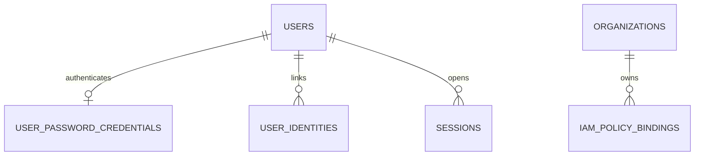
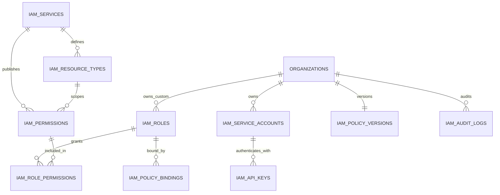
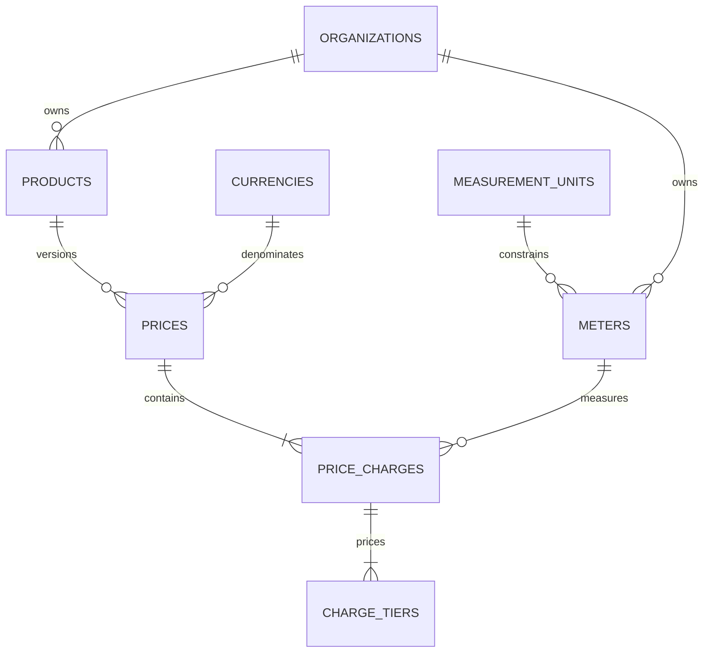
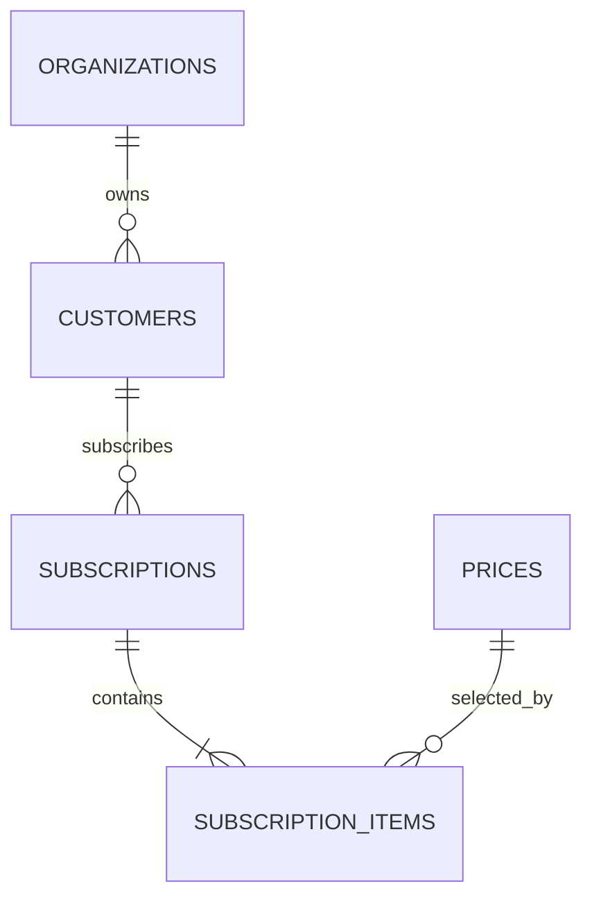
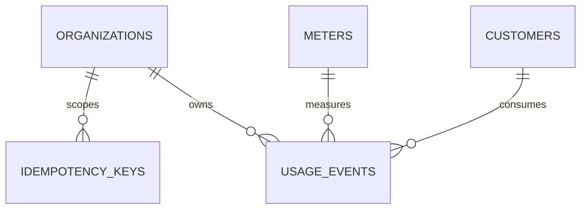
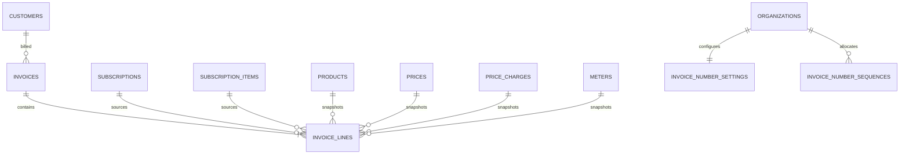

# Domain data model

This document groups the PostgreSQL schema by bounded context. Every tenant
owned table carries `organization_id`; composite foreign keys keep references
inside the same organization.

## Organization and console identity

- `users`, `user_password_credentials`, `user_identities`, and `sessions` serve
  the administrative console only.
- Application customers are stored separately in `customers`.
- Organizations are the tenant boundary for billing and IAM data.

## IAM

PostgreSQL is authoritative. Policy bindings are compiled into Casbin and
atomically swapped in memory. API-key rows store hashes, never plaintext keys.

## Meter and catalogue

- A product is the catalogue root.
- A price is an effective-dated version for one product and currency.
- A price charge connects one meter to `per_unit` or `graduated` pricing.
- A per-unit charge has one zero-based tier; graduated tiers have strictly
  increasing quantity boundaries.
- `currencies` and `measurement_units` are reference tables used by both the
  backend and searchable console selectors.

## Customer and subscription

Subscription items are effective-dated. Enabling another product during a
billing cycle adds an item to the existing subscription. History is ended with
`end_at`; rows are not deleted by the application update workflow.

## Usage ingestion

`idempotency_keys` protects request retries for 24 hours. The permanent unique
event identity is `(organization_id, event_id)`, so expiring an idempotency key
cannot duplicate usage.

## Rating and invoice

Rating intersects billing, subscription, subscription-item, and price periods,
then creates one line for every charge with billable usage. Each line persists
fixed-point quantity, unit price, amount, and tier details so the calculation
can be audited after the catalogue changes.

The MVP stops at draft invoice generation. Payment, credit notes, tax engines,
commitments, and ledger accounting remain outside the current schema.
